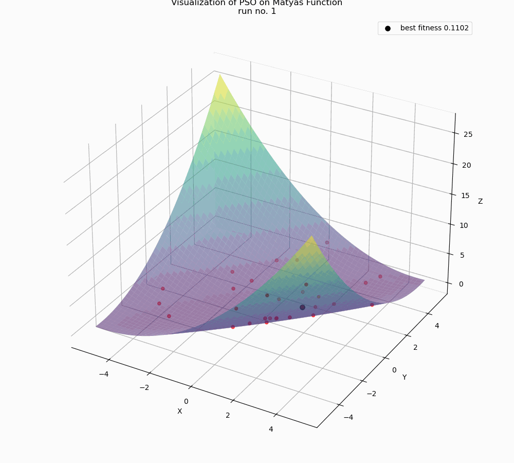
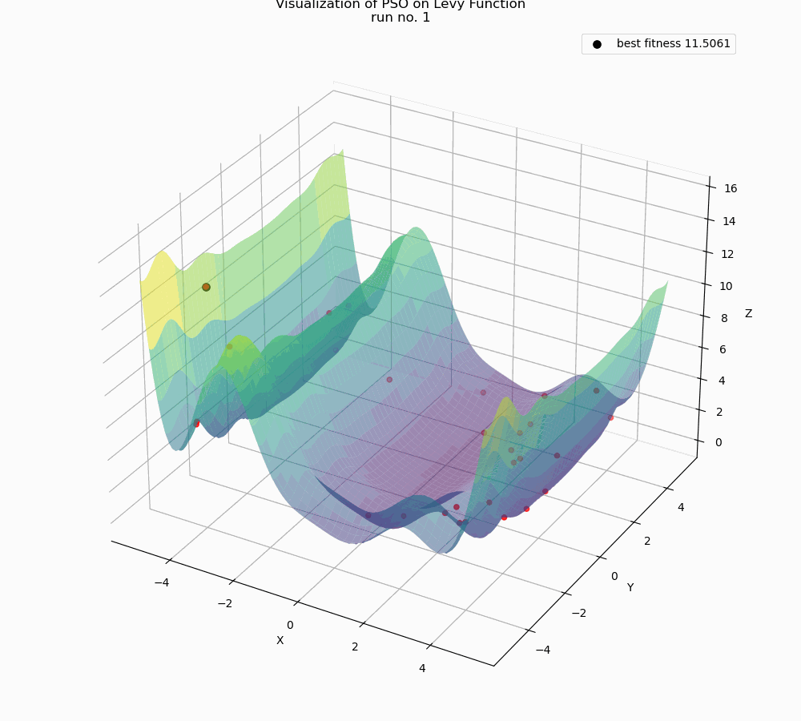

# Particle Swarm Optimization (PSO) Implementation

This project implements and visualizes the Particle Swarm Optimization algorithm as well as the Grey Wolf Optimization algorithm for various benchmark functions.

## Usage

Run `PROGRAM.py` to start the program:
   ```
   python PROGRAM.py
   ```

## Sample Visualization

### 1. PSO algorithm minimizing the Matyas benchmark function:

<p align="center">
  
</p>

This animation demonstrates how the particles converge towards the global minimum of the Matyas function over multiple iterations.

# 2. PSO algorithm maximizing the Levy benchmark function:

<p align="center">

</p>

This animation demonstrates how the particles converge towards the global maximum of the Levy function over multiple iterations.

## Folders
1. `Animated`: Contains some previously made PSO visualization GIFs of famous benchmark functions

## Files
1. `PROGRAM.py`: The main menu of the program.

2. `psalg.py`: Core implementation of the PSO algorithm.

3. `funcs.py`: Contains 27 benchmark functions used for testing the PSO algorithm, as well as a custom function parser.

4. `check_implementation.py`: Evaluates the algorithm's performance by running it for a specific number of iterations. Calculates mean and standard deviation of results.

5. `plotted_pso.py`: Visualizes the benchmark function with swarm particles superimposed, showing the state before and after running the algorithm.

6. `drw.py`: Contains functions for visualizing the Particle Swarm Optimization (PSO) process and creating animated GIFs of the optimization.

7. `animate.py`: Creates animated visualizations of the PSO process, allowing users to choose benchmark functions or input custom functions for optimization.

### List of Benchmark Functions Supported
1. ackley
2. beale
3. booth
4. bukin
5. cross_in_tray
6. drop_wave
7. easom
8. eggholder
9. goldstein_price
10. griewank
11. himmelblau
12. holder_table
13. langermann
14. levy
15. matyas
16. mccormick
17. michalewicz
18. rastrigin
19. rosenbrock
20. schaffer_n2
21. schaffer_n4
22. schwefel
23. shubert
24. sphere
25. styblinski_tang
26. three_hump_camel
27. trid
28. Input custom function

## Requirements

- NumPy
- Matplotlib
